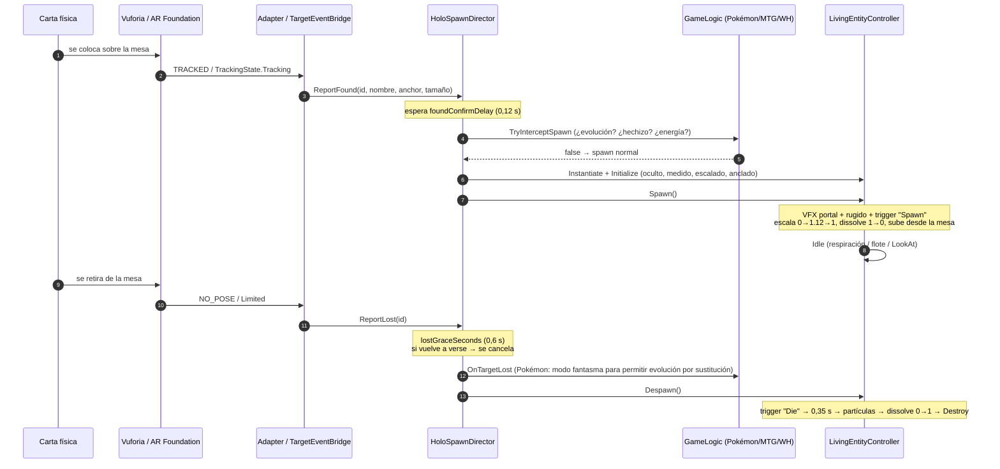

# Configurar OnTargetFound / OnTargetLost para que Spawn y Die se sincronicen con la carta física

Esta guía cubre **Vuforia**, **AR Foundation** y **Meta Quest 3**. En los tres casos el principio es el mismo:

> El SDK **nunca** instancia ni destruye hologramas. Solo **informa** («carta vista» / «carta perdida») a
> `HoloSpawnDirector`, que es quien decide cuándo invocar, cuándo esperar y cuándo disolver.

Así la sincronización es idéntica sea cual sea el SDK, y se evitan los tres fallos típicos de los
tutoriales (hologramas hijos del ImageTarget):

| Problema típico | Causa | Cómo lo resuelve HoloTable |
|---|---|---|
| El monstruo parpadea o se reinvoca al pasar la mano por encima | El SDK pierde la carta 1–3 frames | **Periodo de gracia** (`lostGraceSeconds`, 0,6 s). Si la carta vuelve antes, se cancela la muerte |
| Aparecen hologramas “fantasma” | Falsos positivos de 1 frame | **Retardo de confirmación** (`foundConfirmDelay`, 0,12 s) antes del Spawn |
| El modelo tiembla con el tracking | Pose cruda del SDK | El holograma **no es hijo** del target: lo sigue con suavizado exponencial y solo en *yaw* |
| Un Pokémon KO reaparece al volver a detectar su carta | Re-detección de la misma carta | La entrada queda marcada como **“gastada”** hasta que la carta sale de la mesa |

---

## 1. Línea temporal de una carta

Parámetros en el inspector de `HoloSpawnDirector`:

| Campo | Por defecto | Recomendación |
|---|---|---|
| `foundConfirmDelay` | 0,12 s | 0,05 en Vuforia (muy estable), 0,15–0,2 en ARCore |
| `lostGraceSeconds` | 0,6 s | 0,4 para cartas, 1,0 para miniaturas (se tapan más con la mano) |
| `catalog` | — | `CardCatalog` maestro que incluye los de cada juego |
| `hudPrefab` | — | Prefab con `EntityHUD` (Canvas World Space, escala 0,001) |

---

## 2. Vuforia Engine (móvil / tablet / HoloLens)

### Opción A — recomendada: `VuforiaTargetAdapter` (sin cablear eventos)

1. Crea los targets: **GameObject → Vuforia Engine → Image Target** (o **Model Target** para miniaturas).
2. En `Image Target Behaviour`: Database = tu base de datos; Image Target = la carta. **Width = 0,063** (m).
   El tamaño real es crítico: con él se calcula la escala del holograma y las distancias de combate/pulgadas.
3. **Elimina** (o deja sin uso) el `DefaultObserverEventHandler`. Los hologramas **no** deben ser hijos del target.
4. Añade el componente **`VuforiaTargetAdapter`**.
   - `Extended Tracking Counts As Found` = **false** para cartas (si no, al retirar la carta el holograma seguiría vivo porque Vuforia extrapola la pose).
   - Para miniaturas sobre una mesa estática puedes ponerlo a **true**.
   - `Reference Name Override` vacío → se usa el nombre del target en la base de datos, que debe coincidir con `Reference Image Names` del `EntityDefinition`.
5. **Vuforia Configuration → Max Simultaneous Tracked Images**: súbelo (p. ej. 6–10) para partidas con varias cartas.

Mapeo de estados:

| `Status` de Vuforia | Acción |
|---|---|
| `TRACKED` | `ReportFound` → Spawn (tras confirmación) |
| `EXTENDED_TRACKED` | `ReportLost` (o Found si activaste la opción) |
| `LIMITED` | `ReportLimited` → el holograma se congela en su sitio, no muere |
| `NO_POSE` | `ReportLost` → Die tras el periodo de gracia |

### Opción B — cero código: `DefaultObserverEventHandler` + `TargetEventBridge`

Útil si ya tienes escenas montadas con los eventos del inspector.

1. En el Image Target, deja el `DefaultObserverEventHandler` con **Consider target as visible if its status is: `Tracked`**
   (no *Tracked, Extended Tracked* — si no, retirar la carta no dispara *On Target Lost*).
2. Añade **`TargetEventBridge`** al mismo GameObject. `Reference Name` = nombre en el catálogo (vacío = nombre del GameObject). `Physical Size` = (0,063, 0,088).
3. Cablea en el inspector:
   - **On Target Found ()** → `TargetEventBridge.OnTargetFound`
   - **On Target Lost ()** → `TargetEventBridge.OnTargetLost`
4. No pongas el prefab 3D como hijo del target: lo instancia el director.

> ⚠️ No llames a `Animator.SetTrigger("Spawn")` ni a `Destroy()` directamente desde estos eventos: se perderían
> la confirmación, el periodo de gracia y la lógica de evolución/hechizos.

---

## 3. AR Foundation (ARKit, ARCore, visionOS, OpenXR)

1. **XR Origin (Mobile AR)** con `ARSession`.
2. Crea una **Reference Image Library** (*Create → XR → Reference Image Library*):
   - Una entrada por carta. **Name** = exactamente el nombre que pondrás en `EntityDefinition → Reference Image Names`.
   - Marca **Specify Size** = (0,063 × 0,088 m). Sin tamaño físico, ARKit no estima bien la profundidad y la escala del holograma será incorrecta.
   - Usa escaneos planos y con buen contraste (arte de la carta, no el marco común a todas).
3. En el XR Origin añade **`ARTrackedImageManager`**:
   - `Serialized Library` = tu librería.
   - `Max Number Of Moving Images` = nº de cartas que se moverán a la vez (p. ej. 6).
   - **`Tracked Image Prefab` = vacío** (el director instancia los hologramas).
4. Añade **`ARFoundationTrackingAdapter`** al mismo GameObject.
   - `Treat Limited As Lost` = **true** en iOS/Android: ARKit y ARCore reportan `Limited` cuando la imagen sale de cámara o se tapa.
5. El adaptador detecta automáticamente la versión: en **AR Foundation 6** usa `trackablesChanged`, en la 5 `trackedImagesChanged` (define `HOLO_ARF6` vía *Version Defines* del asmdef).

Limitaciones de AR Foundation a tener en cuenta:
- Dos copias **idénticas** de la misma carta no se rastrean a la vez (misma imagen de referencia). Para mazos con copias, usa Vuforia o marca cada funda con un código.
- ARCore puede tardar ~0,5 s en re-detectar: sube `lostGraceSeconds` a 0,8–1,0.

---

## 4. Meta Quest 3 (passthrough + hand tracking)

A día de hoy **ni Vuforia ni el proveedor OpenXR de Meta para AR Foundation ofrecen tracking de imágenes en Quest 3**.
Por eso la arquitectura separa el tracking en adaptadores. Opciones reales:

| Opción | Cómo conectarla |
|---|---|
| **Passthrough Camera API** de Meta + detector propio (Unity Sentis / OpenCV for Unity) | Tu detector llama a `HoloSpawnDirector.Instance.ReportFound(id, nombre, anchor, tamaño)` / `ReportLost(id)` |
| **Códigos QR** (MRUK *Trackables*, disponible en versiones recientes del Meta XR SDK — verifica la tuya) en la funda de la carta o el lateral de la peana | Crea un GameObject por QR con `TargetEventBridge` y llama a `OnTargetFound/OnTargetLost` desde el evento del trackable |
| Anclaje manual (el jugador “pellizca” sobre la carta) | `TargetEventBridge.OnTargetFound()` desde un `XRSimpleInteractable` |

Resto de piezas en Quest 3: `HandDiceThrower` (XR Hands) para los dados, `EnvironmentDimmer.onDimLevelChanged`
conectado al brillo de `OVRPassthroughLayer` para oscurecer la habitación en los hechizos, y `TableSpace.Align(...)`
con la superficie de mesa de MRUK.

---

## 5. Animator Controller compatible con `LivingEntityController`

Recomendado: **un único controller base** (`AC_HoloCreature_Base`) y un **Animator Override Controller** por criatura.
Todas comparten estados y parámetros; solo cambian los clips.

**Parámetros**: `Spawn` (Trigger) · `Attack` (Trigger) · `TakeDamage` (Trigger) · `Die` (Trigger) · `IsFlying` (Bool)

| Transición | Condición | Duración | Has Exit Time |
|---|---|---|---|
| Entry → **Spawn** (estado por defecto) | — | — | — |
| Spawn → **Idle** | — | 0,25 s | ✔ (1,0) |
| Any State → **Attack** | `Attack` | 0,10 s | ✘ |
| Attack → Idle | — | 0,20 s | ✔ (0,9) |
| Any State → **TakeDamage** | `TakeDamage` | 0,05 s | ✘ (*Can Transition To Self* ✘) |
| TakeDamage → Idle | — | 0,15 s | ✔ (0,85) |
| Any State → **Die** | `Die` | 0,10 s | ✘ |
| Idle ↔ **Hover** (blend tree) | `IsFlying` | 0,3 s | ✘ |

**Animation Events** (en el clip, se reenvían solos gracias a `AnimationEventRelay`):
- `AnimEvent_AttackImpact` en el frame del zarpazo / fogonazo → sincroniza proyectil y daño. Activa `Use Attack Impact Event` en el `LivingEntityController`.
- `AnimEvent_Roar` en el rugido del clip de Spawn → evento `Roared` (sonido, vibración, shake).

Si el modelo **no tiene clips**, no hace falta nada: el controlador ejecuta versiones procedurales
(escala de invocación, respiración, embestida, temblor de daño, disolución).
Si tu controller no tiene transiciones, usa `Drive Mode = CrossFadeStates` y se hará `CrossFade` directo a los estados por nombre.

## 6. Shader de holograma

`HologramMaterialDriver` usa `MaterialPropertyBlock` y **solo toca las propiedades que existan**. Para el efecto completo,
crea un Shader Graph (URP, Transparent o Alpha Clip) con:

| Propiedad | Tipo | Uso |
|---|---|---|
| `_DissolveAmount` | Float 0–1 | Ruido > valor → Alpha Clip. Borde brillante con `step` doble → Emission |
| `_HoloTint` | Color HDR | Fresnel + scanlines multiplicadas por el tinte (viene de `EntityDefinition.hologramTint`) |
| `_HoloFlash` / `_HoloFlashColor` | Float / Color | `lerp(color, flashColor, flash)` → golpes (rojo) y evolución (blanco) |

Sin shader propio también funciona: el flash se aplica a `_BaseColor`/`_Color` y la disolución se sustituye por escala.
