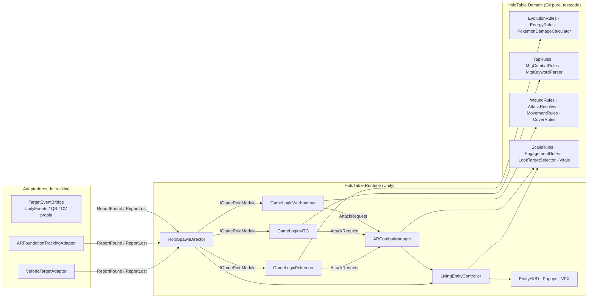

# pokmag · HoloTable XR

*[English](README.md) · Español*

Plataforma de mesa holográfica en **Unity** (AR Foundation · Vuforia · Meta Quest 3) donde cartas de
**Pokémon TCG**, **Magic: The Gathering** y miniaturas de **Warhammer 40K** cobran vida como hologramas 3D
al ponerlas sobre la mesa, al estilo de los duelos de Yu-Gi-Oh.

- **Reglas reales, testeadas.** Evolución, debilidad/resistencia, coste de energía, *first strike*, *trample*,
  *deathtouch*, *lifelink* de ambos lados, tabla F vs R, salvaciones con FP/cobertura (solo a distancia)/invulnerable…
  viven en un dominio C# puro con **132 tests xUnit** (incluye casos límite verificados contra las reglas oficiales).
- **Independiente del SDK.** Un director central recibe «carta vista / carta perdida» de cualquier tracker
  (Vuforia, AR Foundation, QR en Quest, visión por computador propia) y sincroniza Spawn/Die sin parpadeos.
- **Datos, no código.** Una carta nueva es un `ScriptableObject` y una imagen de referencia.

## Los 5 sistemas pedidos

| Pedido | Archivo | Qué hace |
|---|---|---|
| `LIVING_ENTITY_CONTROLLER.CS` | [`Runtime/Entities/LivingEntityController.cs`](Packages/com.adrimg.holotable/Runtime/Entities/LivingEntityController.cs) | Máquina de estados Spawn→Idle→Attack/TakeDamage→Die con Animator (triggers o cross-fade) **y fallbacks procedurales** si el modelo no tiene clips · LookAt de cabeza + giro de cuerpo hacia el rival más cercano o hacia el jugador (IK humanoide o hueso genérico con límites) · escala dinámica (pequeños caben en su carta, dragones sobresalen) · seguimiento suavizado del anchor · altura de vuelo · disolución por shader · HUD 3D |
| `GAME_LOGIC_POKEMON.CS` | [`Runtime/Games/Pokemon/GameLogicPokemon.cs`](Packages/com.adrimg.holotable/Runtime/Games/Pokemon/GameLogicPokemon.cs) | Evolución AR al **apilar** la carta encima **o sustituirla** en el mismo sitio (siluetas blancas alternándose cada vez más rápido + capullo de partículas), conserva daño y energías · auras elementales · energías físicas que se «enganchan» al Pokémon cercano · ataques con coste, debilidad ×2, resistencia −30 y pop-ups «¡Es súper eficaz!» |
| `GAME_LOGIC_MTG.CS` | [`Runtime/Games/MTG/GameLogicMTG.cs`](Packages/com.adrimg.holotable/Runtime/Games/MTG/GameLogicMTG.cs) + [`MtgSpellCaster.cs`](Packages/com.adrimg.holotable/Runtime/Games/MTG/MtgSpellCaster.cs) | *Tapping* por rotación física de 90° (con histéresis y tolerancia a cartas del revés) → «ATACANTE» / «HABILIDAD ACTIVADA» · **bloqueo físico**: el defensor desliza su criatura junto al atacante · voladores («Flying»/«Vuela») a 30 cm con sombra de contacto realista · hechizos que oscurecen la habitación real y lanzan rayos desde el techo · vidas y mareo de invocación |
| `GAME_LOGIC_WARHAMMER.CS` | [`Runtime/Games/Warhammer/GameLogicWarhammer.cs`](Packages/com.adrimg.holotable/Runtime/Games/Warhammer/GameLogicWarhammer.cs) | Selección por mirada · anillo + cilindro holográfico con el Movimiento exacto en pulgadas **medido desde la posición inicial** (se pone rojo si mueves la miniatura de más) · Avance con D6 · láser rojo de LoS con 9 rayos contra terreno virtual **y la malla real de la habitación** (Visible / Cobertura / Bloqueada) · secuencia Impactar→Herir→Salvar con **dados físicos lanzados con la mano** |
| `AR_COMBAT_MANAGER.CS` | [`Runtime/Combat/ARCombatManager.cs`](Packages/com.adrimg.holotable/Runtime/Combat/ARCombatManager.cs) | Distancias físicas entre targets en el plano de la mesa · eventos de enfrentamiento · corrutinas: animación de ataque → frame de impacto → proyectil de partículas con pool que **persigue la posición actual** del defensor (o golpe cuerpo a cuerpo) → impacto → HP y reacción de daño |

Entregables de documentación:

- [`Docs/SETUP_TRACKING.md`](Docs/SETUP_TRACKING.md) — OnTargetFound/OnTargetLost en **Vuforia**, **AR Foundation** y **Quest 3**, línea temporal Spawn/Die, Animator Controller y shader.
- [`Docs/FOLDER_STRUCTURE.md`](Docs/FOLDER_STRUCTURE.md) — estructura de carpetas y convenciones para Pokémon / MTG / Warhammer.

## Desarrollado con ECC (everything-claude-code)

El proyecto aplica y trae integrado [ECC](https://github.com/affaan-m/ecc) en `.claude/`:

| Pieza de ECC | Cómo se usa aquí |
|---|---|
| `hexagonal-architecture` | Dominio puro ↔ puertos (`IGameRuleModule`, `IRandomSource`, `ReportFound/Lost`) ↔ adaptadores por SDK |
| `tdd-workflow` + `csharp-testing` | Cada bug de reglas encontrado se reprodujo primero con un test en rojo (MTG *reminder text*, cobertura en melee, 0 daño con debilidad, *lifelink* del bloqueador) |
| Agentes `csharp-reviewer`, `silent-failure-hunter`, `performance-optimizer`, `pr-test-analyzer` | Revisión adversarial en paralelo; ~50 hallazgos verificados y corregidos (bloqueos de `_busy`, hechizos colgados, VFX sin pool, GC por frame, fugas de materiales, fallos silenciosos de configuración) |
| *santa-loop* (doble revisión hasta converger) | Tras corregir, una segunda ronda de revisión independiente valida el diff |
| `verification-loop` + hooks de `rules/csharp` | Hook `PostToolUse` (`.claude/hooks/verify-csharp.sh`): tras editar un `.cs` compila todos los scripts y, si es dominio, pasa los tests |
| Skill propia `holotable-unity` | Recetas para añadir cartas, reglas, juegos nuevos o adaptadores de SDK sin romper nada |

Licencia MIT de ECC en [`.claude/THIRD_PARTY_NOTICES.md`](.claude/THIRD_PARTY_NOTICES.md).

## Arquitectura (puertos y adaptadores)



- **Domain** no referencia `UnityEngine` (`noEngineReferences: true`): se compila y testea con `dotnet test`.
- Cada **adaptador** tiene su propio asmdef con *Version Defines*: solo compila si el paquete (ARF, Vuforia, XR Hands, Input System) está instalado. Un proyecto solo-Vuforia no necesita AR Foundation y viceversa.
- Los **módulos de juego** implementan `IGameRuleModule` y pueden interceptar una carta antes de que se convierta en criatura (evolución, energía, hechizo). Añadir Yu-Gi-Oh o Lorcana = otro módulo.

## Instalación y demo en 2 minutos (sin hardware AR)

Requisitos: Unity 2021.3.18+ (recomendado 2022.3 LTS o Unity 6). uGUI y TextMeshPro se instalan solos.

1. En un proyecto 3D/URP: **Window ▸ Package Manager ▸ + ▸ Add package from git URL…** y pega:
   ```
   https://github.com/adrimg3196/pokmag.git?path=/Packages/com.adrimg.holotable#v0.2.0
   ```
   (quita `#v0.2.0` para seguir la última versión de `main`). El simulador usa **Input System** (viene en las plantillas de Unity 6);
   si falta, el asistente ofrece instalarlo.
2. Menú **HoloTable ▸ Create Demo Scene** (importa las cartas demo, los recursos de TextMeshPro y monta la escena).
3. **Play**. Con el simulador de escritorio colocas cartas virtuales con el ratón y juegas a los tres juegos;
   los hologramas se generan con primitivas si la carta aún no tiene modelo 3D. Controles: [`Docs/DESKTOP_SIMULATOR.md`](Docs/DESKTOP_SIMULATOR.md).

### Pasar a AR real

1. Instala AR Foundation (iOS/Android) o Vuforia y añade el adaptador correspondiente: [`Docs/SETUP_TRACKING.md`](Docs/SETUP_TRACKING.md).
2. Datos: *Create ▸ HoloTable ▸ Pokemon/Card, MTG/Card, Warhammer/Datasheet*. `Reference Image Names` = nombre de la imagen en tu librería.
   El prefab `HOLO_*` es opcional (sin él se usa el holograma procedural).
3. Agrupa las definiciones en un `CardCatalog` y asígnalo al `HoloSpawnDirector`.

Comandos útiles (públicos y sin parámetros para botones XR / UnityEvents):
`GameLogicWarhammer.Shoot / Advance / ConfirmMove / CycleWeapon / Deselect / ResetMovement`,
`GameLogicMTG.BeginTurn(side)`, `GameLogicPokemon.DeclareAttackOnNearestRival(attacker, index)`.

## Verificación sin Unity

```bash
dotnet test  Tests/HoloTable.Domain.Tests     # 132 tests de reglas (C# 9, como Unity)
python3 Tools/UnityCompileCheck/check.py     # compila cada asmdef por separado, como Unity
```

`UnityCompileCheck` usa las DLL de referencia públicas de UnityEngine y *stubs* mínimos de TextMeshPro, uGUI, AR Foundation,
Vuforia, XR Hands e Input System: detecta errores de C# en nuestro código, no cambios de API de esos SDK.
La validación definitiva sigue siendo abrir el proyecto en Unity. Ambos pasos corren en CI (`.github/workflows/ci.yml`).

## Comunidad

- Licencia del código: [MIT](LICENSE). Proyecto fan no oficial: lee [TRADEMARKS.md](TRADEMARKS.md) (sin arte ni escaneos oficiales).
- Contribuir: [CONTRIBUTING.md](CONTRIBUTING.md) · Código de conducta: [CODE_OF_CONDUCT.md](CODE_OF_CONDUCT.md) · Seguridad: [SECURITY.md](SECURITY.md).
