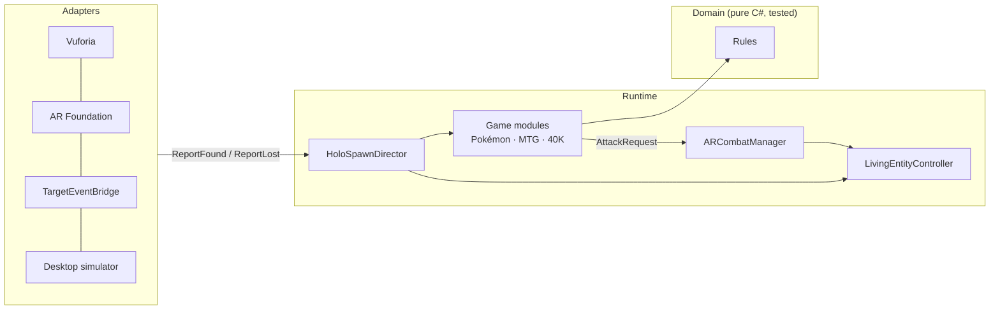

# HoloTable XR

*English · [Español](README.es.md)*

[](https://github.com/adrimg3196/pokmag/actions/workflows/ci.yml)


**Put a physical card on the table and watch it come alive.** HoloTable XR is a Unity package that turns
**Pokémon TCG** cards, **Magic: The Gathering** cards and **Warhammer 40K** miniatures into animated 3D holograms
in mixed reality, Yu-Gi-Oh duel-disk style: creatures roar into existence, stare at their rivals, evolve when you
stack the evolution card, fly over the board, cast room-darkening spells and roll physical AR dice.

> Unofficial fan project, not affiliated with Nintendo/The Pokémon Company, Wizards of the Coast or Games Workshop.
> No official art or card scans are included. See [TRADEMARKS.md](TRADEMARKS.md).

## Try it in 2 minutes — no AR device, no 3D models needed

1. Unity 2021.3.18+ (2022.3 LTS or Unity 6 recommended), any 3D/URP project.
2. **Window ▸ Package Manager ▸ + ▸ Add package from git URL…**
   ```
   https://github.com/adrimg3196/pokmag.git?path=/Packages/com.adrimg.holotable#v0.2.0
   ```
   (drop `#v0.2.0` to track the latest `main`)
3. Menu **HoloTable ▸ Create Demo Scene** → imports the demo cards and TextMeshPro essentials and builds a wired scene.
   The desktop simulator uses Unity's **Input System** (included in Unity 6 templates); if it's missing, the wizard
   offers to install it.
4. Press **Play**. The desktop simulator lets you place virtual cards with the mouse and play all three games.
   Cards without a 3D model spawn a procedural placeholder hologram.

| Desktop controls | |
|---|---|
| `1`–`9`, `Tab` | pick a card from the catalog |
| Left-click / drag | place / move a card (drop it on another to cover it → Pokémon evolution) |
| Right-click | tap / untap (MTG attack) |
| `H` / `X` | hide or lift a card / remove it |
| `Space` / `Shift+Space` | Pokémon attack 1 / 2 on the nearest rival |
| `S`, `F`, `V`, `C`, `Q`, `Esc` | Warhammer select-target, shoot, advance, confirm move, weapon, deselect |
| `N` | next turn · middle-drag orbit · wheel zoom |

More in [Docs/DESKTOP_SIMULATOR.md](Docs/DESKTOP_SIMULATOR.md).

## Features

| System | What it does |
|---|---|
| **LivingEntityController** | Spawn → Idle → Attack / TakeDamage → Die state machine (Animator triggers or cross-fades, with procedural fallbacks when a model has no clips) · head and body look-at toward the player or the nearest rival · dynamic scale (small creatures fit their card, dragons tower over the board) · smoothed anchor following · hover · shader dissolve · world-space HUD |
| **HoloSpawnDirector** | SDK-agnostic bridge: debounced *found/lost*, per-game ghost persistence and re-attach (a lifted miniature keeps its wounds), spent-card memory, queued reports while disabled, clear warnings for any missing setup |
| **Pokémon** | Evolution by stacking or swapping the physical card (flickering white silhouettes + particle cocoon, damage and energies carried over) · energy cards attach to the nearby Pokémon · elemental auras · weakness ×2 / resistance −30 · energy cost check · floating damage numbers |
| **Magic: The Gathering** | Tap detection from the card's 90° rotation (hysteresis, upside-down tolerant) · physical blocking by sliding a creature next to the attacker · flying/reach, first strike, trample, deathtouch, lifelink · fliers hover 30 cm with a contact shadow · instants/sorceries darken the real room and strike with lightning · life totals |
| **Warhammer 40K** | Holographic movement ring in inches measured from the start position (turns red if exceeded) · advance · red line-of-sight laser tested against virtual terrain **and the real room mesh** (clear / cover / blocked) · hit → wound → save sequence with physical, hand-thrown AR dice (10th edition rules) |
| **ARCombatManager** | Engagement detection from physical distances · attack choreography: animation → impact frame → pooled homing projectile → hit reaction · always resolves (timeouts, exactly-once callbacks) |
| **Adapters** | AR Foundation 5/6, Vuforia 10+, UnityEvents bridge (Quest QR / custom CV), XR Hands dice throwing, Input System swipe dice and desktop simulator |

**Rules are real and tested:** a pure C# domain with **132 xUnit tests**, including edge cases checked against the
official rules (MTG comprehensive rules, 40K 10th ed. core rules, Pokémon TCG rulebook).

## Architecture



- **Domain** has no `UnityEngine` reference and is tested with `dotnet test`.
- **Adapters** each live in their own assembly and only compile when their SDK package is installed
  (AR Foundation, Vuforia, XR Hands and Input System are all optional).
- **Games** implement `IGameRuleModule`; adding Lorcana or Yu-Gi-Oh is another module.

## Going to real AR

Follow [Docs/SETUP_TRACKING.md](Docs/SETUP_TRACKING.md) *(in Spanish)* (Vuforia, AR Foundation, Meta Quest 3) and
[Docs/FOLDER_STRUCTURE.md](Docs/FOLDER_STRUCTURE.md) *(in Spanish)*. Create cards with *Create ▸ HoloTable ▸ …*, set
*Reference Image Names* to the names in your image library, optionally assign a `HOLO_*` prefab, and add them to a
`CardCatalog`.

## Develop without Unity

```bash
dotnet test  Tests/HoloTable.Domain.Tests      # rules
python3 Tools/UnityCompileCheck/check.py      # compiles each asmdef separately, like Unity (reference DLLs + SDK stubs)
python3 Tools/generate_meta.py --check         # every package file has a .meta (required for git installs)
```

The compile check uses minimal stubs for AR Foundation, Vuforia, XR Hands, Input System and TextMeshPro; the final
gate is always Unity itself.

## Contributing

PRs welcome — see [CONTRIBUTING.md](CONTRIBUTING.md), [CODE_OF_CONDUCT.md](CODE_OF_CONDUCT.md) and
[SECURITY.md](SECURITY.md). The repo ships an [ECC](https://github.com/affaan-m/ecc) setup in `.claude/`
(reviewer agents, C# rules, TDD and verification skills, a compile-check hook) for AI-assisted contributions.

## License

Code: [MIT](LICENSE). Game names belong to their owners — see [TRADEMARKS.md](TRADEMARKS.md).
