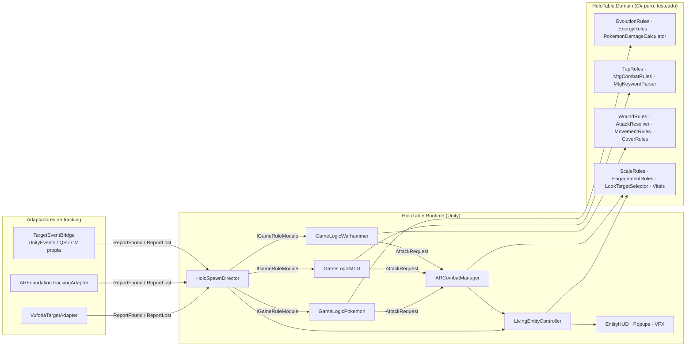

# pokmag · HoloTable XR

Plataforma de mesa holográfica en **Unity** (AR Foundation · Vuforia · Meta Quest 3) donde cartas de
**Pokémon TCG**, **Magic: The Gathering** y miniaturas de **Warhammer 40K** cobran vida como hologramas 3D
al ponerlas sobre la mesa, al estilo de los duelos de Yu-Gi-Oh.

- **Reglas reales, testeadas.** Evolución, debilidad/resistencia, coste de energía, *first strike*, *trample*,
  *deathtouch*, tabla F vs R, salvaciones con FP/cobertura/invulnerable… viven en un dominio C# puro con **75 tests xUnit**.
- **Independiente del SDK.** Un director central recibe «carta vista / carta perdida» de cualquier tracker
  (Vuforia, AR Foundation, QR en Quest, visión por computador propia) y sincroniza Spawn/Die sin parpadeos.
- **Datos, no código.** Una carta nueva es un `ScriptableObject` y una imagen de referencia.

## Los 5 sistemas pedidos

| Pedido | Archivo | Qué hace |
|---|---|---|
| `LIVING_ENTITY_CONTROLLER.CS` | [`Runtime/Entities/LivingEntityController.cs`](Assets/_HoloTable/Scripts/Runtime/Entities/LivingEntityController.cs) | Máquina de estados Spawn→Idle→Attack/TakeDamage→Die con Animator (triggers o cross-fade) **y fallbacks procedurales** si el modelo no tiene clips · LookAt de cabeza + giro de cuerpo hacia el rival más cercano o hacia el jugador (IK humanoide o hueso genérico con límites) · escala dinámica (pequeños caben en su carta, dragones sobresalen) · seguimiento suavizado del anchor · altura de vuelo · disolución por shader · HUD 3D |
| `GAME_LOGIC_POKEMON.CS` | [`Runtime/Games/Pokemon/GameLogicPokemon.cs`](Assets/_HoloTable/Scripts/Runtime/Games/Pokemon/GameLogicPokemon.cs) | Evolución AR al **apilar** la carta encima **o sustituirla** en el mismo sitio (siluetas blancas alternándose cada vez más rápido + capullo de partículas), conserva daño y energías · auras elementales · energías físicas que se «enganchan» al Pokémon cercano · ataques con coste, debilidad ×2, resistencia −30 y pop-ups «¡Es súper eficaz!» |
| `GAME_LOGIC_MTG.CS` | [`Runtime/Games/MTG/GameLogicMTG.cs`](Assets/_HoloTable/Scripts/Runtime/Games/MTG/GameLogicMTG.cs) + [`MtgSpellCaster.cs`](Assets/_HoloTable/Scripts/Runtime/Games/MTG/MtgSpellCaster.cs) | *Tapping* por rotación física de 90° (con histéresis y tolerancia a cartas del revés) → «ATACANTE» / «HABILIDAD ACTIVADA» · **bloqueo físico**: el defensor desliza su criatura junto al atacante · voladores («Flying»/«Vuela») a 30 cm con sombra de contacto realista · hechizos que oscurecen la habitación real y lanzan rayos desde el techo · vidas y mareo de invocación |
| `GAME_LOGIC_WARHAMMER.CS` | [`Runtime/Games/Warhammer/GameLogicWarhammer.cs`](Assets/_HoloTable/Scripts/Runtime/Games/Warhammer/GameLogicWarhammer.cs) | Selección por mirada · anillo + cilindro holográfico con el Movimiento exacto en pulgadas **medido desde la posición inicial** (se pone rojo si mueves la miniatura de más) · Avance con D6 · láser rojo de LoS con 9 rayos contra terreno virtual **y la malla real de la habitación** (Visible / Cobertura / Bloqueada) · secuencia Impactar→Herir→Salvar con **dados físicos lanzados con la mano** |
| `AR_COMBAT_MANAGER.CS` | [`Runtime/Combat/ARCombatManager.cs`](Assets/_HoloTable/Scripts/Runtime/Combat/ARCombatManager.cs) | Distancias físicas entre targets en el plano de la mesa · eventos de enfrentamiento · corrutinas: animación de ataque → frame de impacto → proyectil de partículas con pool que **persigue la posición actual** del defensor (o golpe cuerpo a cuerpo) → impacto → HP y reacción de daño |

Entregables de documentación:

- [`Docs/SETUP_TRACKING.md`](Docs/SETUP_TRACKING.md) — OnTargetFound/OnTargetLost en **Vuforia**, **AR Foundation** y **Quest 3**, línea temporal Spawn/Die, Animator Controller y shader.
- [`Docs/FOLDER_STRUCTURE.md`](Docs/FOLDER_STRUCTURE.md) — estructura de carpetas y convenciones para Pokémon / MTG / Warhammer.

## Arquitectura (puertos y adaptadores)



- **Domain** no referencia `UnityEngine` (`noEngineReferences: true`): se compila y testea con `dotnet test`.
- Cada **adaptador** tiene su propio asmdef con *Version Defines*: solo compila si el paquete (ARF, Vuforia, XR Hands, Input System) está instalado. Un proyecto solo-Vuforia no necesita AR Foundation y viceversa.
- Los **módulos de juego** implementan `IGameRuleModule` y pueden interceptar una carta antes de que se convierta en criatura (evolución, energía, hechizo). Añadir Yu-Gi-Oh o Lorcana = otro módulo.

## Puesta en marcha

Requisitos: Unity 2022.3 LTS o Unity 6 · URP · TextMeshPro · uno de: AR Foundation 5/6, Vuforia 10+ · opcional XR Hands, Input System.

1. Copia `Assets/_HoloTable` a tu proyecto (Unity generará los `.meta`).
2. Escena: `XR Origin` (o `ARCamera` de Vuforia) y un GameObject **HoloTable** con:
   `TableSpace`, `HoloSpawnDirector` (asigna `CardCatalog` y `EntityHUD`), `ARCombatManager`, `DamagePopupService`,
   `GameLogicPokemon`, `GameLogicMTG`, `GameLogicWarhammer` y, para Warhammer, un `DiceTray`.
3. Tracking: sigue [`Docs/SETUP_TRACKING.md`](Docs/SETUP_TRACKING.md) (un componente adaptador y listo).
4. Datos: *Create → HoloTable → Pokemon/Card, MTG/Card, Warhammer/Datasheet*. Rellena `Reference Image Names`
   con el nombre de la imagen en tu librería y asigna el prefab `HOLO_*` (raíz con `LivingEntityController`, hijo con el modelo).
5. Agrupa las definiciones en un `CardCatalog` (*Create → HoloTable → Card Catalog*).

Comandos útiles (todos públicos y sin parámetros para botones XR / UnityEvents):
`GameLogicWarhammer.Shoot / Advance / ConfirmMove / CycleWeapon / Deselect / ResetMovement`,
`GameLogicMTG.BeginTurn(side)`, `GameLogicPokemon.DeclareAttackOnNearestRival(attacker, index)`.

## Verificación sin Unity

```bash
dotnet test  Tests/HoloTable.Domain.Tests     # 75 tests de reglas (C# 9, como Unity)
dotnet build Tools/UnityCompileCheck          # compila TODOS los scripts contra UnityEngine 2021.3 (NuGet)
```

`UnityCompileCheck` usa las DLL de referencia públicas de UnityEngine y *stubs* mínimos de TextMeshPro, uGUI, AR Foundation,
Vuforia, XR Hands e Input System: detecta errores de C# en nuestro código, no cambios de API de esos SDK.
La validación definitiva sigue siendo abrir el proyecto en Unity. Ambos pasos corren en CI (`.github/workflows/ci.yml`).
